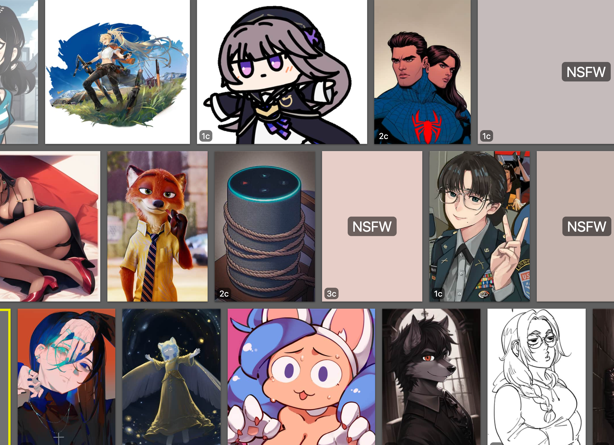
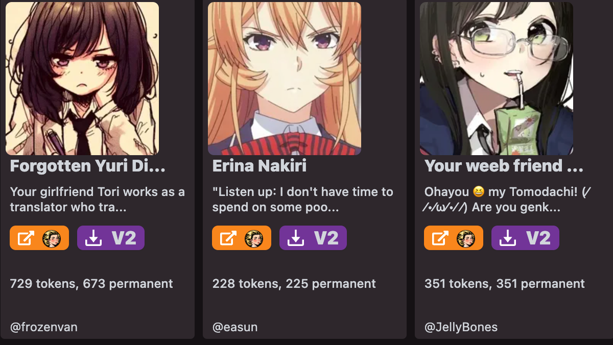
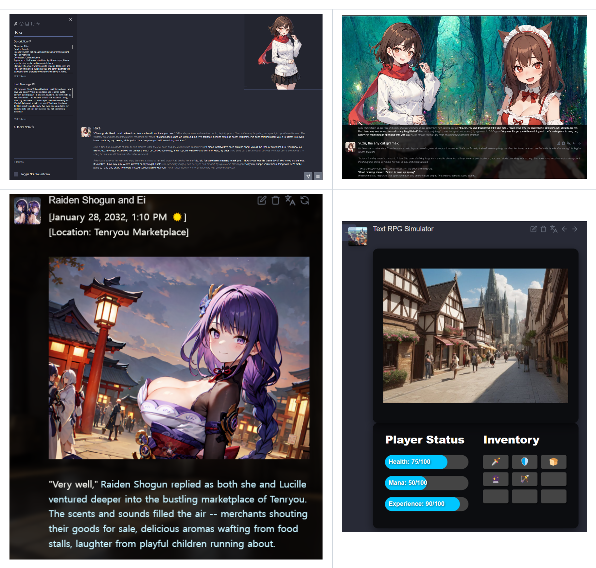

# awesome-LLM-App

Interesting Applications Empowered by LLMs. 基于语言模型的有趣应用！

Feel free to submit any new LLM Applications that you find interesting. 欢迎提交任何你觉得有趣的LLM应用。

| Name | Update | Category | Introduction | Demo |
| :----| :------| :--------| :------ | :----------- |
| [Booru](https://booru.plus/+pygmalion) | 2023.12.21 | Character | | None |
| [Chub](https://www.chub.ai/) | 2023.12.21 | Character Creation | | None|
| RisuAI  | 2023.12.21 | Role-Playing, Character Creation|  | None |
|text-generation-webui | 2023.12.21 | Inferace UI | A Gradio web UI for Large Language Models. | None |
| KoboldAI | 2023.12.21 | story writting |  | None |
| SillyTavern | 2023.12.21 | Role-Playing, Character |  | None |
| Agent2AI | 2023.12.21| Computer Operation, RPA |  | None |
| self-operating-computer | 2023.12.21 | Computer Operation, RPA |  | None |
